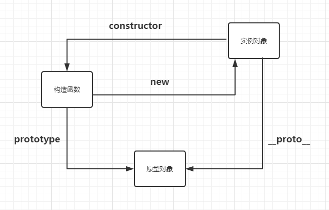

# 面向对象编程 - prototype对象

@(prototype)[构造函数][原型对象]

####  1.1 构造函数的缺点

JavaScript 通过构造函数生成新对象，因此构造函数可以视为对象的模板。实例对象的属性和方法可以定义在构造函数内部。

```javascript
function Cat (name, color) {
    this.name = name;
  	this.color = color;
}
var cat1 = new Cat('大毛', '白色');
cat1.name; // 大毛
cat1.color; // 白色
```

上面代码的 `Cat` 函数是一个构造函数，函数内部定义了 `name` 属性和 `color` 属性，所有实例对象都会生成这两个属性。但是，这样做是对系统资源的浪费，因为同一个构造函数生成的对象实例之间，无法共享属性。

```javascript
function Cat (name, color) {
    this.name = name;
  	this.color = color;
  	this.meow = function () {
        console.log('mew, mew, mew...');
    }
}
var cat1 = new Cat('大毛', '白色');
var cat2 = new Cat('二毛', '黑色');
cat1.meow === cat2.meow; // false
```

上面的代码中， `cat1` 和 `cat2` 对象实例都来自同一个构造函数 `Cat` ，但是他们的 `meow` 方法却是不一样的，就是说，每新建一个对象实例，都会新建一个 `meow` 方法。这既没有必要，又浪费系统资源，因为所有的 `meow` 方法都是同样的行为，完全应该共享。


#### 1.2 prototype属性的作用

JavaScript 的每个对象都继承另一个对象，后者称为“原型”（prototype）对象。只有 `null` 除外，它没有自己的原型对象。

原型对象上的所有属性和方法，都能被派生对象共享。这就是 JavaScript 继承机制的基本设计。

通过构造函数生成对象实例，会自动为实例对象分配原型对象。每个构造函数都有一个 `prototype` 属性，这个属性就是实例对象的原型对象。

```javascript
function Animal (name) {
    this.name = name;
}
Animal.prototype.color = 'white';

var cat1 = new Animal('大毛');
var cat2 = new Animal('二毛');

cat1.color // white
cat2.color // white
cat1.color === cat2.color // true
```

> 只有函数才有 `prototype` 属性，构造函数生成的实例对象没有 `prototype` 属性，但是有 `__proto__` 属性，指向的就是构造函数的 `prototype` 属性；

实例对象的原型对象不是自身的属性，只要修改原型对象，变动就会立即体现在 **所有** 实例对象上。

如果实例对象自身就有某个属性或方法，它就不会再去原型对象寻找这个属性或方法。

```javascript
cat1.color = 'black';
cat2.color; // white
Animal.prototype.color; // white
```

原型对象的作用，就是定义所有实例对象共享的属性和方法。这也是它被称为原型对象的原因，而实例对象可以视作从原型对象衍生出来的子对象。


#### 1.3 原型链

对象的属性和方法，有可能定义在它自身，也有可能定义在它的原型对象上，原型本身也是对象，也有自己的原型，所以生成了一条原型链（prototype chain）。

所有对象的最终原型是 `Object.prototype` ，`Object.prototype` 的原型就是没有任何属性和方法的 `null` ，而  `null` 对象没有自己的原型。

	Object.getPrototypeOf(Object.prototype);
	// null

#### 1.4 constructor 属性

- `prototype` 默认有一个 `constructor` 属性，默认指向 `prototype` 对象所在的构造函数。
- 由于 `constructor` 属性定义在 `prototype` 对象上面，意味着可以被所有实例对象继承。
- `constructor` 属性的作用，是分辨原型对象属于哪个构造函数。
- 通过`name`属性可以从实例得到构造函数的名称。`XXXX.constructor.name`
- 有了 `construct` 属性就可以从一个实例创建另一个实例了


```javascript
var cat3 = new cat1.constructor();
```

在实例方法中，调用自身的构造函数原型对象的方法创建新的实例成为可能。

```javascript
Constr.prototype.createCopy = function () {
    return new this.constructor();
}
```

避免覆盖原来的 `prototype` 属性，要么将 `constructor` 属性重新指向原来的构造函数，要么只在原型对象上添加方法，这样可以保证 `instanceof` 运算符不会失真。

```javascript
// 避免这种写法
C.prototype = {
    method1: function () {}
}

// 较好的写法
C.prototype = {
    constructor: C,
  	method1: function () {}
}

// 更好的方式
C.prototype.method1 = function () {}
```


### 2. instanceof运算符

`instanceof` 运算符返回一个布尔值，表示制定对象是否为某个构造函数的实例。
- 判断值的类型。
- 只能用于对象，不适于原始类型的值。
- 对于`undefined` 和 `null` ，`instanceof ` 总是返回 `false`。
- 利用 `instanceof` 可以巧妙地解决，调用构造函数时，忘记加 `new` 命令的问题。以下是范例

``` javascript
function Fubar(foo, bar) {
	if(this instanceof Fubar){
		this.foo = foo;
		this.bar = bar;
	} else {
		return new Fubar(foo, bar);
	}
}
```

### 3. Object.getPrototypeOf()

`Object.getPrototypeOf()` 方法返回一个对象的原型。这是获取原型对象的标准方法。

``` javascript
function F () {}
var f = new F();
Object.getPrototypeOf(f) === F.prototype;
// true
```

### 4. Object.setPrototypeOf()
`Object.setPrototypeOf` 方法可以现有对象设置原型，返回一个新对象。
`Object.setPrototypeOf` 方法接受两个参数，第一个是现有对象，第二个是原型对象。

``` javascript
var a = { x: 1 };
var b = Object.setPrototypeOf({}, a);
b.x  // 1
```

### 5. Object.creat()
通过一个实例对象生成另一个实例对象
- 使用 `Object.creat` 方法必须提供对象原型，即参数不能为空，或者不是对象。
- `Object.create` 方法生成的对象，动态继承了原型。在原型上添加或者修改任何方法，会立刻反映在新对象上。
- `Object.create` 方法生成的对象，继承了它的原型对象的构造函数。

``` javascript
//PS1
var obj1 = { p: 1 };
var obj2 = Object.create(obj1);
obj1.x = 2;
obj2.x   //2;

//PS2
function A () {}
var a = new A();
var b = Object.create(a);

b.constructor === A //true
b instanceof A //true
```

### 6. Object.prototype.isPrototypeOf()
用来判断一个对象是否是另一个对象的原型。
- 只要某个对象处在原型链上，`isPrototypeOf` 都返回 `true`
- 由于`Object.prototype` 处于最顶端，所以对各种实例都返回 `true` ，只有继承 `null` 的对象除外。


### 7. Object.prototype.\__proto\__
`__proto__` 属性（前后各两个下划线）可以改写某个对象的原型对象。
- 只有浏览器才需要部署，本质是内部属性，不建议使用此属性进行操作。


### 8. 获取原型对象方法的比较
获取实例对象的原型方法有三种

``` javascript
obj.__proto__
obj.constructor.prototype
obj.getPrototypeOf(obj)
```

前两种都不是很靠谱，建议使用第三种


下面一张图是我对原型、构造函数、实例对象以及原型链的理解




> 本文来自阮一峰老师的[《JavaScript 标准参考教程（alpha）》](http://javascript.ruanyifeng.com)第四章[面向对象编程](http://javascript.ruanyifeng.com/#oop) 的 [ prototype 对象](http://javascript.ruanyifeng.com/oop/prototype.html)章节的学习笔记。